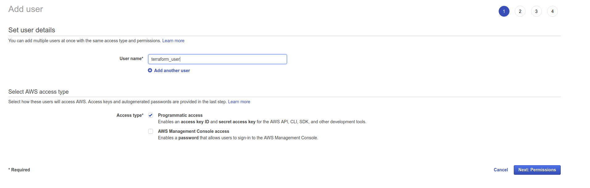
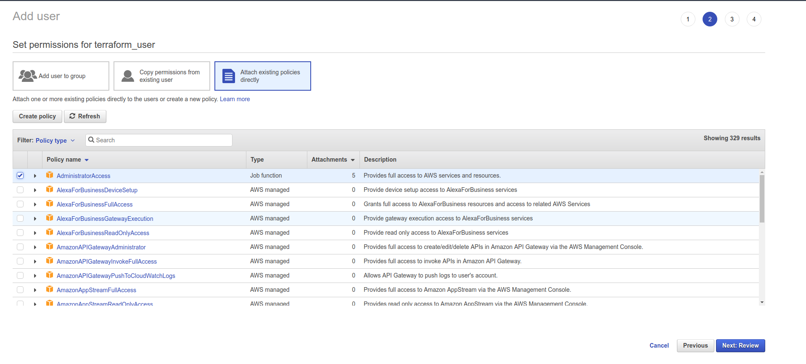
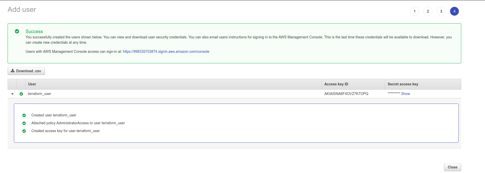

# hands-on-aws-lambda
AWS Lambda Hands-on

Configuring AWS
In order to follow the best practices, let’s create a user for Terraform. Go to your AWS console and create terraform_user user:

Give it the good rights. In my example, I need Terraform to be able to manage all of my AWS Cloud resources:

Don’t forget to store the AWS access key id and secret access key:

