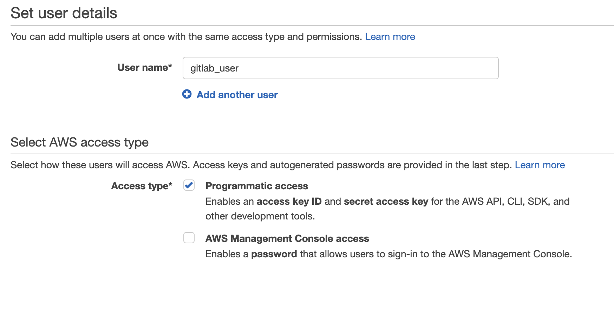
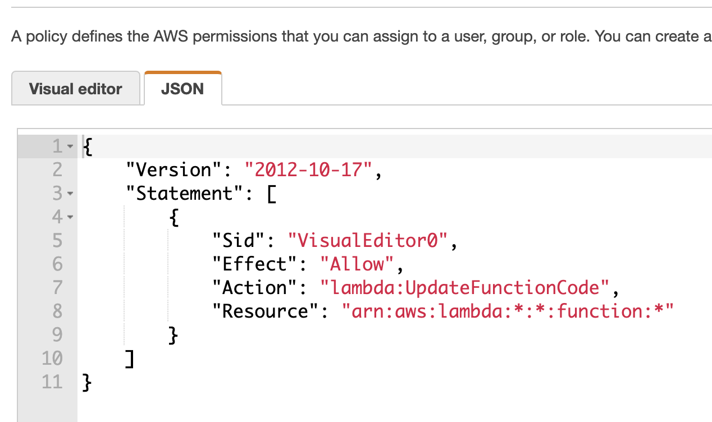

# Create AWS user for Terraform

1. Go to https://console.aws.amazon.com/iam/home#/users and create gitlab user:

2. Add the following permission to allow gitlab to update function code:

3. Don’t forget to store the AWS access key id and secret access key:

