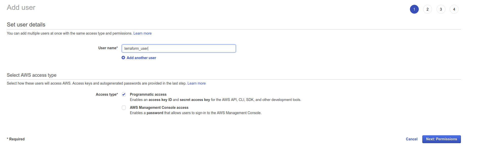
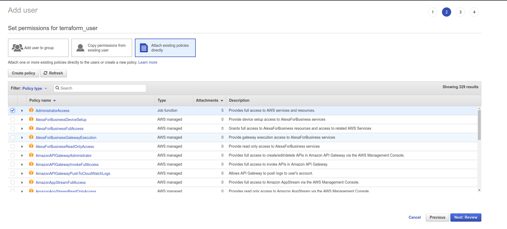
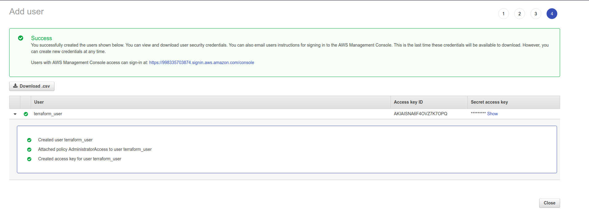

# Create AWS user for Terraform

1. Go to https://console.aws.amazon.com/iam/home#/users and create terraform_user user:

2. Give it the rights to manage the resources you need. In the example below it has AdministratorAccess:

3. Don’t forget to store the AWS access key id and secret access key:

